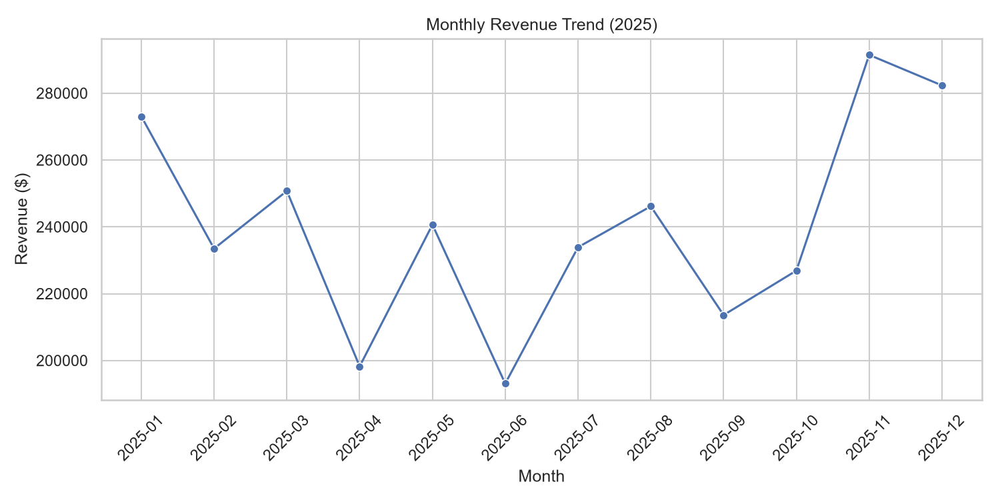

# Retail Sales Analysis

A simple end-to-end data analysis project: generate a synthetic retail sales
dataset, then analyze it with `pandas` to surface KPIs, revenue trends, and
category/region breakdowns — with charts built in `matplotlib`/`seaborn`.

## What it demonstrates

- Data wrangling with **pandas** (grouping, pivoting, aggregation)
- KPI calculation (total revenue, average order value, top category/region)
- Time-series analysis (monthly revenue trend)
- Data visualization with **matplotlib** / **seaborn**
- Clean, reproducible project structure

## Project structure

```
retail-sales-analysis/
├── data/
│   └── sales_data.csv          # generated dataset (5,000 transactions)
├── outputs/
│   ├── summary.txt             # KPI summary
│   ├── monthly_revenue_trend.png
│   ├── revenue_by_category.png
│   └── revenue_by_region_channel.png
├── src/
│   ├── generate_data.py        # creates the synthetic dataset
│   └── analysis.py             # runs the analysis, saves charts + summary
├── requirements.txt
└── README.md
```

## How to run

```bash
# 1. Clone the repo
git clone https://github.com/<your-username>/retail-sales-analysis.git
cd retail-sales-analysis

# 2. Install dependencies
pip install -r requirements.txt

# 3. Generate the dataset
python src/generate_data.py

# 4. Run the analysis
python src/analysis.py
```

Charts and a summary file will be saved to `outputs/`.

## Sample results

| Metric | Value |
|---|---|
| Total Revenue | ~$2.88M |
| Total Orders | 5,000 |
| Avg. Order Value | ~$577 |
| Top Category | Electronics |
| Top Region | South |
| Online Share | ~64% |



## Possible extensions

- Swap in a real dataset (e.g. from Kaggle) instead of synthetic data
- Add a Jupyter notebook version with narrative commentary
- Build an interactive dashboard with Streamlit or Plotly Dash
- Add basic unit tests for the KPI calculations

## License

MIT

Contributed by Ramesh
